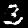
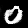
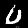
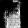
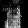
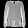
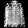
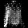

Here's the complete README.md in a single cell for easy copying:
markdown# Generative Adversarial Networks for Data Augmentation
















## Overview

This repository demonstrates the implementation and application of Generative Adversarial Networks (GANs) for data augmentation. It includes comprehensive Jupyter notebooks, worked examples, and an interactive web demonstration to help understand and visualize GAN-generated images.

## Contents

- **Main Notebook**: Comprehensive tutorial on GAN architecture, training, and applications
- **Worked Examples**: Step-by-step implementation comparing GAN performance on MNIST and Fashion-MNIST
- **Web Demo**: Interactive visualization of GAN-generated images and augmentation capabilities
- **Trained Models**: Pre-trained GAN models for both datasets
- **Generated Images**: Samples of GAN outputs at different training stages

## Features

- Deep Convolutional GAN (DCGAN) implementation in TensorFlow
- Conditional GAN (CGAN) for class-specific image generation
- Data augmentation techniques for addressing class imbalance
- Comparison of GAN performance across datasets of varying complexity
- Interactive web interface for exploring GAN outputs

## Installation

```bash
# Clone the repository
git clone https://github.com/yourusername/gan-data-augmentation.git
cd gan-data-augmentation
```

# Create a virtual environment (optional but recommended)
```bash
python -m venv venv
source venv/bin/activate  # On Windows: venv\Scripts\activate
```

# Install dependencies
```bash
pip install -r requirements.txt
```

Usage
Jupyter Notebooks
```bash
# Start Jupyter Lab/Notebook
jupyter lab
```

# Or
jupyter notebook

Then open either:

GAN_Data_Augmentation.ipynb - Main tutorial notebook
GAN_Worked_Examples.ipynb - Comparative implementation

Web Demo


To run the interactive web demo locally:
```bash
Navigate to the web demo directory
cd web_demo
```

# Start a simple HTTP server
```bash
python -m http.server

Open your browser and go to:

http://localhost:8000

```


## GAN Architecture

The implemented GAN architecture consists of:

### Generator
- Input: Random noise vector (100 dimensions)
- Hidden layers: Dense + reshape, followed by transposed convolutions
- Batch normalization and LeakyReLU activations
- Output: 28×28×1 image with tanh activation

### Discriminator
- Input: 28×28×1 image
- Hidden layers: Convolutional layers with stride=2
- LeakyReLU activations and dropout
- Output: Single sigmoid unit (real/fake classification)

## Results

Our implementation achieves:

- MNIST: Clear, recognizable digits after ~50 epochs
- Fashion-MNIST: Recognizable clothing items with longer training (~100 epochs)
- Successful class-conditional generation with CGANs
- Improved classifier performance using GAN-augmented training data

## Training Tips

For optimal GAN training:

1. Use label smoothing (0.9 for real, 0.1 for fake)
2. Apply batch normalization in the generator
3. Use dropout in the discriminator (0.3-0.4)
4. Balance generator/discriminator training carefully
5. Start with a simpler dataset before tackling complex ones

## Implementation Challenges

Several challenges were encountered during implementation:

1. **Training Instability**:
   - Generator and discriminator losses oscillating rather than converging
   - Solution: Implemented label smoothing and adjusted learning rates

2. **Mode Collapse**:
   - Generator producing limited varieties of outputs
   - Solution: Added batch normalization and proper architecture design

3. **Evaluation Difficulty**:
   - Objective assessment of GAN quality is difficult
   - Solution: Combined visual inspection with downstream task performance metrics

## Project Structure
```
gan/
│   ├── GAN_Notebook.ipynb
│   └── GAN_Worked_Examples.ipynb
├── website/
│   ├── index.html
├── gan_outputs/
│   ├── mnist/
│   └── fashion_mnist/
├── models/
│   ├── mnist_generator.h5
│   └── fashion_mnist_generator.h5
├── requirements.txt
└── README.md
```
## Requirements

- Python 3.7+
- TensorFlow 2.4+
- NumPy
- Matplotlib
- Jupyter Lab/Notebook
- A modern web browser for the demo
- 4GB+ RAM recommended for training

## Future Work

Potential extensions to this project include:
1. Implementing more advanced GAN architectures (StyleGAN, WGAN-GP)
2. Exploring cross-domain translation with CycleGAN
3. Applying GANs to higher-resolution images and more complex datasets
4. Incorporating Fréchet Inception Distance (FID) for quantitative evaluation

## License

This project is licensed under License - see the LICENSE file for details.

## Acknowledgments

- Ian Goodfellow et al. for the original GAN paper
- Alec Radford et al. for the DCGAN architecture
- Mehdi Mirza et al. for the Conditional GAN approach
- TensorFlow team for the excellent deep learning framework

## Citation

If you use this code in your research or project, please cite:
